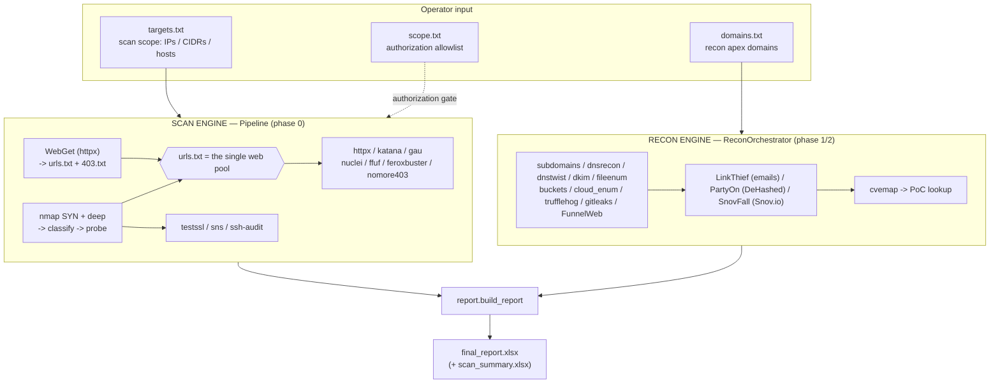

# nigredo

**A two-engine reconnaissance and active-scan orchestrator for authorized penetration testing.**

`nigredo` (Python package `prima_materia`) drives an entire external engagement from a single
command: passive OSINT/recon across a client's domains, an authorized active scan of the
in-scope hosts, and a consolidated Excel deliverable at the end. It wires ~30 industry tools
(nmap, subfinder, httpx, nuclei, ffuf, feroxbuster, nomore403, testssl, katana, gau,
trufflehog, gitleaks, DeHashed, Snov.io, and more) into one resumable, scope-aware pipeline
and folds every result into one workbook.

> ⚠️ **Authorized use only.** nigredo performs active scanning (nmap SYN scans, directory
> fuzzing, template-based vuln checks) and breach/credential lookups, and can optionally
> password-spray. Run it **only** against systems you have explicit written authorization to
> test. You are responsible for staying within your rules of engagement.

---

## Contents

- [What it does](#what-it-does)
- [Core concept: two engines + a scope firewall](#core-concept-two-engines--a-scope-firewall)
- [Install](#install)
- [Quick start](#quick-start)
- [Commands](#commands)
- [How the data flows](#how-the-data-flows)
- [Full run order](#full-run-order)
- [The web pool (single-pool design)](#the-web-pool-single-pool-design)
- [Tool inventory](#tool-inventory)
- [Configuration & scope files](#configuration--scope-files)
- [Campaign mode (many clients at once)](#campaign-mode-many-clients-at-once)
- [Output: the report](#output-the-report)
- [API keys](#api-keys)
- [Repository layout](#repository-layout)
- [About the name](#about-the-name)

---

## What it does

Give it a client's **domains** (for recon) and the authorized **targets** (for scanning), and
it will:

- **Enumerate the attack surface** — subdomains (subfinder → shuffledns → dnsx), DNS records
  and zone transfers, typosquat/lookalike domains, DKIM selectors, and exposed files/documents.
- **Harvest OSINT & credentials** — employee emails (LinkedIn via SerpAPI, Snov.io), breach
  data and credential pairs (DeHashed), GitHub org secrets (trufflehog + gitleaks), and public
  cloud buckets (GrayHatWarfare + cloud_enum).
- **Crawl web apps** — a headless (patchright/Playwright) crawler that harvests JS/PHP and runs
  jsluice, retire.js, semgrep, and secret/login-portal detection over what it finds.
- **Actively scan the in-scope hosts** — nmap (SYN sweep + service/deep scans), web liveness
  probing, content discovery (ffuf, feroxbuster), template vuln scanning (nuclei), 403-bypass
  testing (nomore403), TLS auditing (testssl), IIS short-name discovery (sns), and ssh-audit.
- **Enrich & correlate** — Shodan/InternetDB, CVE mapping from discovered technology (cvemap),
  public PoC lookups, and full ingestion of a Nessus `.nessus` export (reconciled against nmap).
- **Produce one deliverable** — a multi-tab `final_report.xlsx` with a CVSS-ranked findings
  page, a Burp target list, a password-spray list, and a tab per data source — with the raw
  logs embedded inside the workbook file as a travelling backup.

It is **resumable** (every tool writes a completion marker; re-running continues where it left
off) and **scope-safe** (an authorization allowlist gates every active target before a single
packet is sent).

---

## Core concept: two engines + a scope firewall

nigredo has **two independent engines** with a hard boundary between them:

| | Recon engine | Scan engine |
|---|---|---|
| Class | `ReconOrchestrator` (`prima_materia/recon_orchestrator.py`) | `Pipeline` (`prima_materia/pipeline.py`) |
| Driven by | **`domains.txt`** — the client's apex domains | **`targets.txt`** — the authorized IPs/CIDRs/hosts |
| Does | passive/OSINT enumeration, crawling, breach lookups | port scan, web probing, fuzzing, vuln checks, TLS/SSH |
| Touches the target actively? | No (discovery only) | Yes |

**The firewall:** domains typed for recon are **recon input only**. They are never resolved to
an IP and handed to the scan/fuzz side — the scan engine is constructed with
`correlate_domains=[]`, so a recon domain never becomes a scanned host on its own. The division
is by **source** (recon domains vs. `targets.txt`), *not* by IP-vs-hostname: a hostname you
deliberately place in `targets.txt` **is** scanned. Every active target is additionally checked
against `scope.txt` (your authorization allowlist) before nmap runs; an out-of-scope target
halts the run with a `ScopeViolation`.

---

## Install

Target platform is **Kali/Debian-family Linux**. Root is required for nmap's SYN/stealth scans
(the launcher elevates for you).

```bash
./setup.sh            # create the uv venv, install Python deps, offer to install each tool
chmod +x nigredo.sh   # once, after unzipping (zip drops the +x bit)
```

`setup.sh`:

1. Creates a `uv` virtualenv named `nigredo-venv` (falls back to `python -m venv`).
2. Installs the Python dependencies from `requirements.txt` and verifies the critical ones
   actually import (aiohttp/aiofiles/patchright/dns).
3. Installs the **Patchright** browser (undetected Chromium, plus Chrome for `--stealth`) and
   `xvfb` (for an invisible `--stealth` display).
4. Checks every external tool and, for each missing one, **offers to run its install command**
   (`[Y/n]` per tool). Flags: `--yes`/`-y` auto-accepts; `--check-only` reports without installing.
5. Fetches the bundled script tools: **FunnelWeb.py** (ships in the package), **cloud_enum**,
   and **PartyOn** (git-cloned from GitHub, dropped at the tool root, and patched to read the
   DeHashed key from the environment).

**External tools by category:**

- **Go:** subfinder, shuffledns, dnsx, nuclei, ffuf, trufflehog, sns, jsluice
- **apt:** feroxbuster, gitleaks, nmap, dnsrecon, dnstwist, dig (dnsutils), git, ssh-audit, exiftool
- **npm:** retire (retire.js) · **pip:** semgrep, jsbeautifier
- **Special:** testssl.sh (git clone + symlink), FunnelWeb.py (bundled), PartyOn.py (auto-cloned)

> **Why root / the symlink fix:** nmap SYN scans need root, so `nigredo.sh` runs under `sudo`.
> Because `sudo` resets `PATH`, Go tools in `~/go/bin` can fall off it — the launcher carries
> your `PATH` through with `-E env "PATH=$PATH"`, and `setup.sh` offers to symlink Go tools into
> `/usr/local/bin`. Alternatively, grant nmap raw-packet capability so root isn't needed:
> `sudo setcap cap_net_raw,cap_net_admin,cap_net_bind_service+eip $(which nmap)`.

---

## Quick start

A single engagement, end to end:

```bash
./nigredo.sh init      # scaffold the engagement input files
#   -> edit targets.txt  (REQUIRED: the IPs/CIDRs/hosts you're authorized to scan)
#   -> edit scope.txt    (your authorization allowlist)
./nigredo.sh start      # pick "Everything" from the menu, enter the recon domain(s), walk away
```

Without the launcher wrapper (it just handles `sudo` + `uv` for you):

```bash
python run.py engagement-init      # scaffold config.json, recon_config.json, targets.txt, ...
#   edit targets.txt
python run.py engagement           # run
```

`targets.txt` is a **hard requirement** — nigredo will not start a run with an empty
`targets.txt` (no more accidental recon-only runs that burn a day and API credits). CIDRs in
`targets.txt` are expanded to individual IPs automatically where a tool needs it.

---

## Commands

All are subcommands of `python -m prima_materia` (the `nigredo.sh` verbs in parentheses):

| Command | Purpose |
|---|---|
| `engagement-init` (`init`) | Scaffold **all** input files. Preserves existing configs; refreshes an unfilled `targets.txt`. |
| `engagement` (`start`) | The main run. Shows a menu, gathers domains + a setup interview up front, then runs unattended. |
| `recon -c cfg [--with-scan]` | Run the recon engine. `--with-scan` runs phase 0 first — this is the campaign child command. |
| `run -c cfg` | Active-scan `Pipeline` only. |
| `recon-init` | Scaffold `recon_config.json` + `domains.txt`. |
| `campaign {init,configure,run,status}` | Multi-client orchestration (see below). |
| `report -c cfg [-o out]` | Rebuild `final_report.xlsx` from what's already on disk. |
| `install-missing` (`tools`) | Interactive external-tool installer. |
| `prima_materia.adjudicator --folder P [--audit-only]` | Score a finished run and rebuild the workbook; emits a CLEAN/CRASH verdict. |

Useful flags on the run commands: `--dry-run` (print the commands, run nothing), `--yes`
(accept prompts), `--no-prompt` (fully unattended), `--manual` (single-tool mode).

---

## How the data flows



State is handed from stage to stage through on-disk artifacts (the "wires"): `targets.txt`,
`domains.txt`, `urls.txt`/`403.txt` (the web pool), `results.json` (nmap/probe), the per-tool
`*.json/.jsonl/.csv` outputs, and `state.json`/`recon_state.json`/`phase0_state.json` (resume +
live dashboard). `report.build_report` reads them all and assembles the workbook.

---

## Full run order

### Phase 0 — scan engine (`Pipeline.run`)

WebGet (httpx → `urls.txt`/`403.txt`) → nmap **SYN sweep** → Nessus union-merge (if a `.nessus`
is provided) → optional stacked ACK/FIN/NULL/Xmas (off by default) → **Shodan** passive enrich →
nmap **deep** per host → **classify** ports (web/tls/auth/other) → **probe** web endpoints →
`emit_target_files` (sets the web pool to `urls.txt`, or prints a loud `[STOP]` if empty) →
honeypot/Nessus reconcile → Burp live-URL list → TLS-verify → **httpx** (fingerprint) →
**katana** (crawl) → **gau** (recon domains only) → build URL pool → **nuclei** pass 1
(takeover-only) → **nuclei** pass 2 (full, over `urls.txt`) → **ffuf** → **feroxbuster** →
**nomore403** → **testssl** → **sns** (IIS) → **ssh-audit** → write `scan_summary.xlsx`.

Every web/service tool above is wrapped in an isolation helper: if one tool crashes, the rest of
the phase still runs (no more "it ran half the tools and quit").

### Phase 1 — recon engine, per domain

dnsrecon → dnstwist → dkim → subdomains → takeover → submutate → fqdn_resolve → fileenum →
buckets → cloud_enum → trufflehog → gitleaks → **FunnelWeb** (crawler, runs last).

### Phase 2 — recon engine, per domain

**LinkThief** (email enum) → **PartyOn** (DeHashed breach/credential lookup) → **SnovFall** (Snov.io emails).

### Final stage — once, after all domains

Shodan on-demand collect → **cvemap** (CVEs from discovered tech) → PoC cache lookup →
`build_report` → `final_report.xlsx` + a `.campaign_complete` marker.

> The interactive `start` path runs a **discovery pre-pass** (subfinder + WebGet) *before* phase
> 0, so the recon engine then skips re-enumerating subdomains. The campaign child path has no
> pre-pass, so it runs the full subdomain enumeration inside the recon engine instead.

---

## The web pool (single-pool design)

The web fuzzers run off **one** list, authored by **WebGet** (`host_validation.py`):

1. WebGet correlates `targets.txt` (its IP spine, CIDRs expanded) with discovered subdomain
   names, applies an in-scope re-resolution gate, and lets **httpx** decide liveness. A host
   gets a line in **`urls.txt`** only for the scheme(s) httpx confirmed live; 403 responders
   are also recorded in **`403.txt`**.
2. `Pipeline` picks up `urls.txt` as the single web pool (`paths["web_urls"]`). **ffuf**,
   **feroxbuster**, and the full **nuclei** pass all read it. **nomore403** reads the 403 set
   (WebGet's `403.txt` unioned with the 403s ffuf/feroxbuster turned up).
3. **There is no fallback.** If `urls.txt` comes out empty, a loud `[STOP]` banner explains why
   and the web tools skip cleanly rather than silently doing nothing. (The old "fair-game pool"
   and its fallbacks were removed — one pool, one source of truth.)

---

## Tool inventory

### Recon engine — Phase 1

| Tool | Purpose |
|---|---|
| dnsrecon | DNS records + AXFR zone-transfer attempts |
| dnstwist | registered lookalike / typosquat domains (+ WHOIS/NS backfill) |
| dkim | DKIM selector brute-force over a bundled 837-selector list |
| subdomains | passive + resolved subdomain enum (subfinder → shuffledns → dnsx) |
| takeover | subdomain-takeover checks (nuclei `-tags takeover`) |
| submutate | learns the target's naming vocabulary, mutates, re-resolves + validates |
| fqdn_resolve | 2-of-3 (dnsx/Nessus/dig) confirmed FQDN↔IP scope tiers |
| fileenum | SerpAPI filetype/dork document discovery + metadata & secret extraction |
| buckets | GrayHatWarfare cloud bucket/blob enumeration |
| cloud_enum | active AWS/Azure/GCP bucket brute-force |
| trufflehog | GitHub org secret scanning with live verification |
| gitleaks | clones the org's public repos and scans their history |
| FunnelWeb | headless crawler (patchright) → JS/PHP harvest → jsluice/retire.js/semgrep/secrets/login-detect |

### Recon engine — Phase 2

| Tool | Purpose |
|---|---|
| LinkThief (`emailenum`) | LinkedIn employee → email enumeration via SerpAPI |
| PartyOn (`partyon`) | DeHashed breach/credential lookup via the external `PartyOn.py` (optional Entra spray) |
| SnovFall (`snov`) | Snov.io domain email search |

### Recon engine — Final stage

| Tool | Purpose |
|---|---|
| cvemap | maps discovered technology/versions to CVEs |
| cache | looks up public PoCs for those CVEs (records URLs only) |

### Scan engine — Phase 0

| Tool | Purpose |
|---|---|
| nmap | SYN sweep, service/deep `-sV -sC`, optional ACK/UDP/stealth |
| classifier | tags open ports as web / tls / auth_surface / other |
| probe | confirms scheme with curl (records redirects, does not follow cross-host) + TLS handshake |
| shodan | passive InternetDB (free) + optional host-lookup / on-demand scan |
| httpx | web liveness + fingerprinting |
| katana | web crawl |
| gau | archived URL discovery (recon domains only) |
| nuclei | template vuln scanning (full pass over `urls.txt`; separate takeover pass) |
| ffuf | calibrated directory/content discovery with a liveness gate |
| feroxbuster | recursive content discovery (one process per host) |
| nomore403 | 403/401-bypass testing (safe mode strips state-changing verbs) |
| testssl | TLS/SSL audit per endpoint |
| sns | IIS 8.3 short-name discovery + IIS recon enrichment |
| ssh-audit | SSH configuration/algorithm audit |
| Nessus import | parses a `.nessus` export and reconciles it against nmap |

---

## Configuration & scope files

Two config schemas, one file:

- **`Config`** (`config.py`) — phase-0 scan settings: nmap phase params, nuclei/ffuf/feroxbuster/
  testssl knobs, and the WebGet (`hostval_*`) settings.
- **`ReconConfig`** (`recon_config.py`) — phase-1/2 settings: domains file, API keys/toggles, and
  the PartyOn/GrayHat/cloud_enum/FunnelWeb options.

In a normal engagement or campaign, a **single `recon_config.json`** is loaded by *both* schemas —
each tolerates the other's keys, so there's no "unknown key" noise. Environment variables win over
file values for secrets.

**Scope & input files** (in the engagement folder):

| File | Role |
|---|---|
| `targets.txt` | the active-scan scope — IPs, CIDRs, hostnames. **Required.** CIDRs auto-expanded. |
| `scope.txt` | the authorization allowlist (CIDR/IP/host/`*.wild`); every active target is checked against it |
| `domains.txt` | the recon apex domains (recon input only) |

The `targets.txt` requirement is enforced at every entry point — the interactive run, the campaign
child, and the campaign launcher all refuse to proceed with an empty one, and `Pipeline` itself
hard-stops if no in-scope targets remain.

---

## Campaign mode (many clients at once)

For running several clients in one sitting:

```bash
./nigredo.sh campaign-init        # make results/<client>/ folders (targets.txt, domains.txt, per-client recon_config.json)
./nigredo.sh campaign configure   # run the setup interview per client (--mode same | each)
./nigredo.sh campaign run         # launch them (one subprocess per client, --max-parallel N, default 3)
./nigredo.sh campaign status      # where each client stands
```

Each client gets its own folder and `recon_config.json`. `campaign run` classifies clients
(ready / no-recon-domains / **no-targets** / completed / partial), **refuses** any client with an
empty `targets.txt`, and won't re-run a completed client without `--force`. Each child is launched as:

```bash
python -m prima_materia recon --config results/<client>/recon_config.json --no-prompt --with-scan --yes
```

A live TUI **dashboard** shows a per-client progress bar (done/total stages), the current stage,
and elapsed time — a phase-0 bar while scanning, then the recon bar. Press `q` to detach the view;
the run keeps going. `--no-dashboard` prints plain per-client completion lines instead.

---

## Output: the report

Two workbooks land in `results/<engagement>/`:

- **`scan_summary.xlsx`** — written by phase 0.
- **`final_report.xlsx`** — the consolidated deliverable, built by `report.build_report`. It is
  written under a guaranteed-save wrapper (one failing sheet can't sink the file), and the raw
  log/data files are **embedded inside the `.xlsx` archive** as a travelling backup.

Highlights among its tabs:

- **At a Glance** — the FunnelWeb rollup (leftmost).
- **Findings** — CVSS-scored findings (Nessus/cvemap/nuclei) ranked Critical → Low, then a
  divider and non-CVSS quick wins (confirmed takeovers, login portals, 403 bypasses).
- **Targets** grid + **Hosts by Port** — nmap + Nessus, with a certificate column from TLS findings.
- **PartyOn (DeHashed)** — per domain: Valid Accounts → Locked Accounts → Combo Lists →
  Unique Emails → Omitted Backups → Breach Records, plus a raw-results tab.
- **Spray List** — a consolidated password-spray candidate list from every email source.
- **Burp Target URLs** — the scan target list, ready to import.
- Plus per-source tabs: testssl, subdomains, emails (LinkThief), cloud buckets/files, DNS + DKIM,
  domain squatting, FunnelWeb findings, CVEs, IIS recon, JS vulns (retire.js + Snyk-enriched),
  login portals, run notes, and API credit accounting.

A finished run can be re-scored and re-built at any time from disk with the **adjudicator**.

---

## API keys

Set in `recon_config.json` or as environment variables (env wins):

| Env var | Config field | Used by |
|---|---|---|
| `SERPAPI_KEY` | `serpapi_key` | fileenum, LinkThief, Snyk enrichment |
| `SNOV_CLIENT_ID` / `SNOV_CLIENT_SECRET` | — | SnovFall (Snov.io) |
| `GRAYHAT_API_KEY` | `grayhat_api_key` | buckets |
| `SHODAN_API_KEY` | `shodan_api_key` | Shodan host lookup / on-demand scan |
| `PDCP_API_KEY` | `cvemap_api_key` | cvemap (ProjectDiscovery Cloud; relieves rate limits) |
| `GITHUB_TOKEN` | `github_token` | trufflehog, gitleaks |
| `DEHASHED_API_KEY` | `dehashed_api_key` | PartyOn |

Every tool works without its key — it just skips that source. Optional per-tool `*_credit_cap`
fields default to uncapped; a credit ledger tracks and reports API spend regardless.

---

## Repository layout

```
nigredo/
├── README.md              # this file
├── CHANGELOG.md           # running change log (newest first)
├── nigredo.sh             # sudo + uv launcher
├── run.py                 # entry point
├── setup.sh               # installer
├── requirements.txt
├── prima_materia/         # the package (engines, tools, config, report)
├── FunnelWeb.py + js_harvest.py / php_harvest.py / jsluice_scan.py / ...   # bundled crawler + sub-scanners
├── tests/                 # test suite (+ tests/README.md)
└── docs/dev/              # development notes (data-flow internals, manifests, feature docs, batch changelogs)
```

Internal/development documentation lives in [`docs/dev/`](docs/dev/) — data-flow internals,
the file manifest, feature notes, and future plans.

---

## About the name

Alchemy's *nigredo* is the **blackening** — the first stage of the magnum opus, where matter is
broken down to its base before anything can be rebuilt from it. That's the tool's job: decompose a
target's external surface into its raw components so an operator can make sense of it. The package
is `prima_materia`, the "base matter" the work begins from. A few internal tools do not reflect this as display names — **WebGet**, **SnovFall**, **LinkThief**, **PartyOn**, **FunnelWeb**. These tools predate the creation of Nigredo, which represents the collection of work into one methodology for mapping the base components to molecular detail. The tools that do not reflect the name are also available solo on the rest of the github.

            ####WARNING####
THIS IS A WORKING PROTOTYPE AND DOES NOT REPRESENT THR FINAL PRODUCT. IT IS A CURREN WORK IN PROGRESS (WIP) AND REQUIRES FURTHER TESTING AND DEVELOPMENT. CONSIDERABLE TIME HAS BEEN SPENT MAKING NIGREDO, BUT MUCH, MUCH MORE IS REQUIRED. PLEASE USE WITH CAUTION AND RUN DEFAULT OPTIONS WITH BASE SETTINGS FIRST BEFORE YOU BECOME FAMILIAR WITH THE MORE ADVANCED OPTIONS TO DISTINGUISH WHEN THE TOOL HAD A GLITCH VERSUS MISINTERPRETING THE RESULTS. MISSING DATA IN THE FINAL_REPORT.XLSX DOES NOT CONSTITUTE A SKIPPED TOOL. PLEASE CHECK THE MANUAL-RECHECK TAB IN THE FINAL_REPORT.XLSX. ALSO, REALIZE CURRENT RECON_CONFIG.JSON WILL STORE THE API KEYS BETWEEN RUNS. THIS WILL CHANGE IN THE FUTURE, SO YOU CAN DESTROY THE FILE AFTER RUN AND SAVE THE RESULTS WITHIN THE RESULTS FOLDER THAT CONTAINS ALL OUTPUT, ERROR LOGS, TIMESTAMPS, ET AL.
